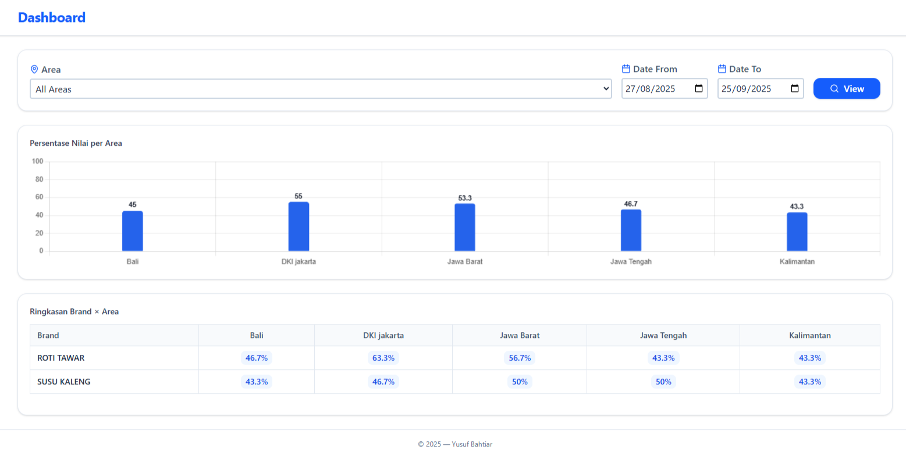
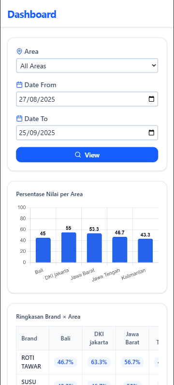

# Frontend Dashboard App

This is the frontend component of a responsive dashboard application built with Vue.js. It integrates with a backend API to display brand summaries, area-specific statistics, and interactive charts. The application is designed to be mobile-friendly with dynamic table rendering, chart visualization, and area filtering.

## Features

- Responsive dashboard with area and date filtering.
- Dynamic table displaying brand and area-specific data (e.g., compliance percentages).
- Interactive bar chart.
- Integration with a backend API for real-time data fetching.

## Prerequisites

- Node.js (v16.x or later)
- npm or yarn
- A code editor (e.g., VS Code)
- Backend API running (e.g., on `http://localhost:8080/`)

## Installation

1. Clone the repository:

   ```bash
   git clone https://github.com/yusufbahtiarr/frontend-pitjaru.git
   ```

2. Enter the project directory
   ```
   cd frontend-pitjaru
   ```
3. Install dependencies:

   ```
   npm install
   ```

4. Set up environment variables:
   Create a .env file in the root directory and add the following:
   ```
   VITE_API=http://localhost:8080/api
   ```
   Adjust the VITE_API URL to match your backend server address.

## Usage

1. Ensure the backend is running:

   Start the backend server (e.g., go run main.go) on http://localhost:8080 (or your configured port).

2. Run the frontend:

   ```
   npm run dev
   ```

   Open your browser and navigate to http://localhost:5173 (or the port specified in the terminal).

3. Interact with the dashboard:
   - Use the dropdown to select an area (e.g., "Bali").
   - Set date range using the "From" and "To" inputs.
   - Click "View" to load table and chart data for the selected area and date range.

## Dependencies

To develop this app, we are using some dependencies:

- `vue` (^3.5.21)
- `axios` (^1.12.2)
- `chart.js` (^4.5.0)
- `chartjs-plugin-datalabels` (^2.2.0)
- `lucide-vue-next` (^0.544.0)

### Development Dependencies

- `@tailwindcss/vite` (^4.1.13)
- `@vitejs/plugin-vue` (^6.0.1)
- `autoprefixer` (^10.4.21)
- `postcss` (^8.5.6)
- `vite` (^7.1.7)

## Preview





## License

This project is licensed under the MIT License. See the LICENSE file for details.
